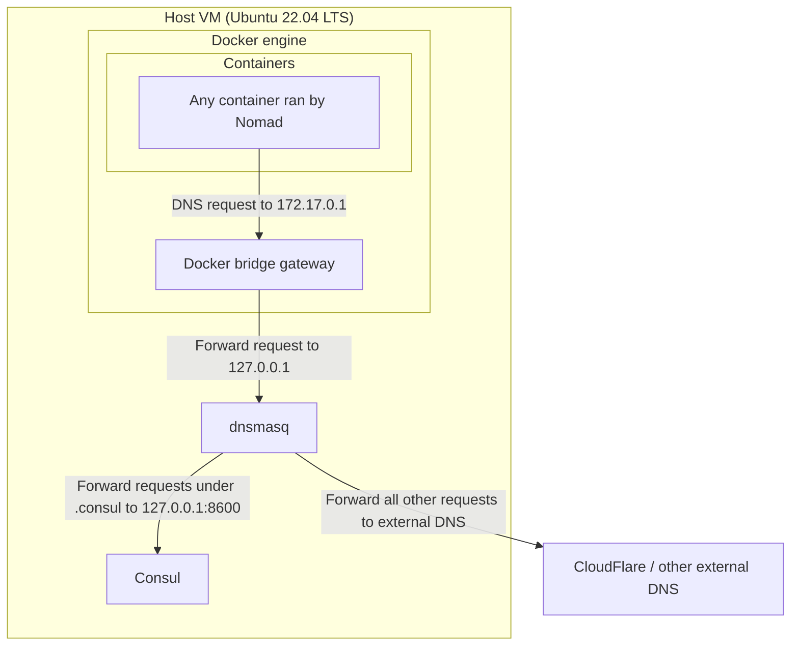
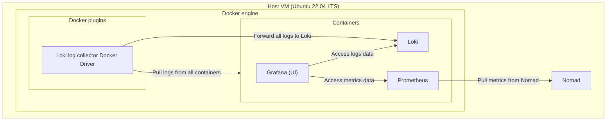

# Nomad & Consul on Ubuntu

This repo sets up a presumed-empty Ubuntu 22.04 LTS machine for dev usage with Nomad and Consul - both of which are installed and configured, but do *not* run as services - you'll need to start each component manually and get to observe their logs in full glory.

Workloads are run using the Docker driver for Nomad. Collection of logs and metrics is done with Grafana/Prometheus/Loki. There is no persistence configured for the collected data.

## Quickstart

```bash
# Install everything
sudo sh 0-setup-ubuntu.sh

# Open one terminal window for Consul
sh 1-start-consul.sh

# Open another terminal window for Nomad
sh 2-start-nomad.sh

# Open a third terminal window and then deploy services to Nomad
sh 3-deploy-services.sh

# To interact with the Nomad cluster, source .envrc first to configure the host + TLS
source .envrc
```

## What the cluster is running as jobs

- Grafana, at [`grafana.service.consul:3000`](http://grafana.service.consul:3000)
    - Configured data sources: Prometheus, Loki
- Prometheus (with UI), at [`prometheus.service.consul:9090`](http://prometheus.service.consul:9090)
    - [Configured to scrape Nomad metrics](https://developer.hashicorp.com/nomad/tutorials/manage-clusters/prometheus-metrics#enable-telemetry-on-nomad-servers-and-clients)
- Loki, at [`loki.service.consul:3100`](http://loki.service.consul:3100)
    - Configured with the Loki docker driver to collect logs from all containers

## Rough architecture of components and how they communicate

### DNS with `dnsmasq` and `Consul`

* Everything under `.consul` is resolved by Consul
* Everything else is resolved externally

<details>
<summary>Diagram</summary>
  


</details>

### Log/metrics collection with `Prometheus`, `Grafana` & `Loki`

* Nomad-agent level Docker-driver config so all containers' logs get collected automatically

<details>
<summary>Diagram</summary>


</details>