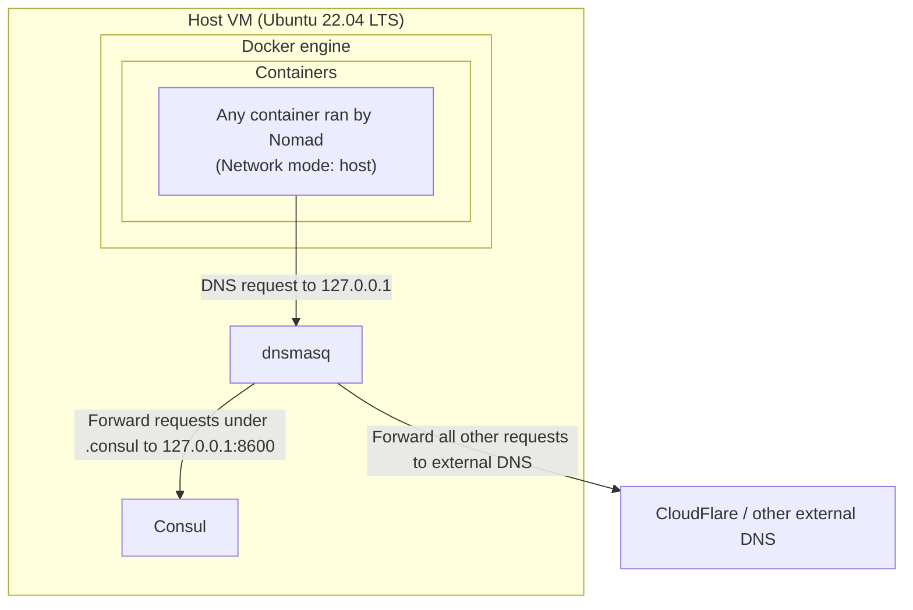
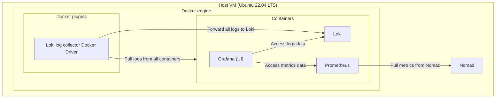

# Nomad & Consul on Ubuntu

This repo sets up a presumed-empty Ubuntu 22.04 LTS machine for dev usage with Nomad and Consul - both of which are installed and configured, but do *not* run as services - you'll need to start each component manually and get to observe their logs in full glory.

Workloads are run using the Docker driver for Nomad. Collection of logs and metrics is done with Grafana/Prometheus/Loki. There is no persistence configured for the collected data.

The [`gitops-controller-draft`](./gitops-controller-draft/) folder contains a Flux-inspired proof of concept/draft of what GitOps could look like on Nomad.

## Quickstart

```bash
# Install everything
sudo sh 0-setup-ubuntu.sh

# Open one terminal window for Consul
sh 1-start-consul.sh

# Open another terminal window for Nomad
sh 2-start-nomad.sh

# Open a third terminal window and then deploy/stop services on Nomad
sh 3-deploy-services.sh
sh 4-stop-services.sh

# To interact with the Nomad cluster, source .envrc first to configure the host + TLS
source .envrc
nomad job status
```

## What the cluster is running

- Traefik, at [`0.0.0.0:8080`](http://localhost:8080) to act as a reverse proxy to all services, served from a static host port at `8080`
  - Serving Grafana at `/grafana/`
  - Serving Prometheus UI at `/prometheus/`
  - Automatic routing to services registered with appropriate Nomad/Consul tags
- Grafana, at `grafana.service.consul` within the service mesh, served from a dynamic port
  - Configured data sources: Prometheus, Loki
- Prometheus (with UI), at `prometheus.service.consul`, served from a dynamic port
  - [Configured to scrape Nomad metrics](https://developer.hashicorp.com/nomad/tutorials/manage-clusters/prometheus-metrics#enable-telemetry-on-nomad-servers-and-clients)
- Loki, at [`loki.service.consul:3100`](http://loki.service.consul:3100)
  - Configured with the Loki docker driver to collect logs from all containers
  - Static host port `3100` as the Docker Driver needs to know the port without templating

## Rough architecture of components and how they communicate

### DNS with `dnsmasq` and `Consul`

- Everything under `.consul` is resolved by Consul
- Everything else is resolved externally

<details>
<summary>Diagram</summary>
  


</details>

### Log/metrics collection with `Prometheus`, `Grafana` & `Loki`

- Nomad-agent level Docker-driver config so all containers' logs get collected automatically

<details>
<summary>Diagram</summary>



</details>

## Useful reference docs

- [Nomad variable interpolation](https://developer.hashicorp.com/nomad/docs/runtime/interpolation#interpreted_env_vars)
- [Load balancing Nomad/Consul with Traefik](https://developer.hashicorp.com/nomad/tutorials/load-balancing/load-balancing-traefik)
- [Nomad networking docs](https://developer.hashicorp.com/nomad/docs/networking)
- [Nomad `network` block docs](https://developer.hashicorp.com/nomad/docs/job-specification/network#port-parameters)
