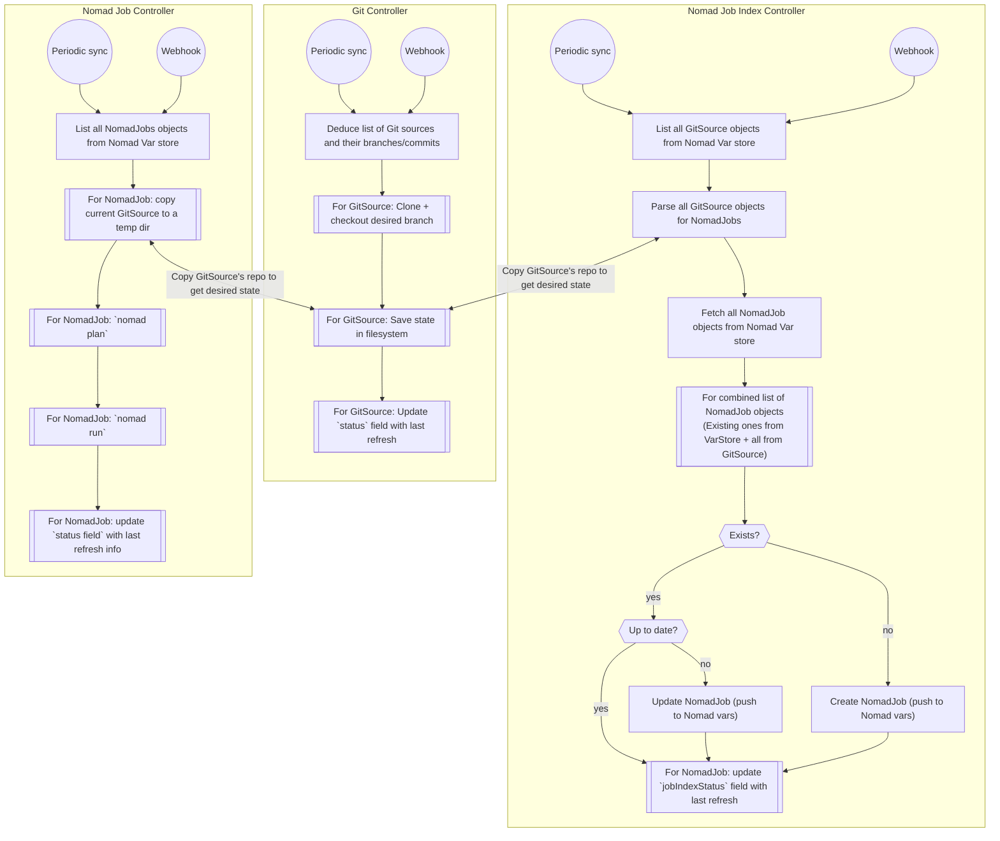

# GitOps for Nomad

This folder contains a quick mockup/POC of what a GitOps controller for Nomad could look like. The structure and overall logic are heavily inspired by [FluxCD](https://fluxcd.io/), especially its `SourceController` and `KustomizeController`. This POC implementation prioritizes fully automatic reconciliation rather than explicitly figuring out diffs/drifts.

I thought this was worth doing, since though there are some implementations for Nomad GitOps already, they generally don't have a lot of following/support, and do not seem to be all that well documented. A tightly scoped set of controllers would likely be a better way to go. [Hashicorp's API for Nomad](https://pkg.go.dev/github.com/hashicorp/nomad/api) is well-documented and relatively straightforward to work with.

## Development commands

```bash
# install go deps
go get .

# to run the controller's primary loops just once, set the ONE_OFF flag as follows
export NOMAD_GITOPS_ONE_OFF=true

# start the controller
go run .

# helpers to work with Nomad
make putvars     # push initial manifests for a GitRepository and NomadJob
make install     # compile the Go binary and make it accessible for local Nomad cluster
make deploy      # run a job to deploy the controller to Nomad
```

## High-level structure and design drafting

[Nomad Variables](https://developer.hashicorp.com/nomad/tutorials/variables/variables-create) allow storing "shared state" similar to how the storage of various objects works in Kubernetes. However, there is a size limit of `64KiB` ([ref](https://developer.hashicorp.com/nomad/api-docs/variables/variables)) on variables, though in my view this should be sufficient.

The primary "`CRDs`" are defined in [this file](./data_structures.go);

- `GitRepository`, struct `GitRepositoryObject`
  - Responsible for storing information about the desired repositories (url, branch) to be fetched
  - Also responsible for defining the relative path and file name filters to choose JobSpec files
- `NomadJob`, struct `NomadJobObject`
  - Responsible for storing information about a particular job in Nomad

The controllers are structured similarly, the below bullet points describe their *current* functionality:

- [controller_gitrepository.go](./controller_gitrepository.go)
  - Fetch list of `GitRepository` objects from Nomad variable store
  - Clone each of these repositories to a configurable path
  - Update the `status_current_commit` field with the latest commit after cloning
- [controller_nomadjob.go](./controller_nomadjob.go)
  - Fetch list of `NomadJob` objects from Nomad variable store
  - Fetch list of `GitRepository` objects from Nomad variable store
  - Go though each job present in Nomad Variable store, referring to the now-present local clone of the relevant repository
  - Find the job spec files defined in these repositories (using relative path and regex filters for file names)
  - Register (=run) these jobs on Nomad

There is one critical step missing at the moment, which is to be able to **declaratively and automatically create** new NomadJob specs from the contents of each Git Repository. This could make sense as its own separate controller in the middle (~ `NomadJobIndex` controller or so), as a step that runs *after* `GitRepository` controller, but before `NomadJob` controller. This will need some further thought as having multiple operators touching the same object types (`NomadJob`s) introduces potential clashes/race conditions/other painful issues.  

Both resources would also benefit from additional `status` fields to provide more information about the current revision of each app, last update time, reasons for failure, if any, etc. Optimally I would like to see all the information necessary to debug behaviour just by looking at the `status_` fields of these objects - there should be no need to always look at the controller's logs.

Finally, adding some type of webhook/API endpoint to trigger immediate reconciliation (or pause reconciliations temporarily) would also improve the operator experience significantly

## Basic logic flow

*This includes the third controller - `NomadJobIndex` Controller - that does not yet exist.*



## Misc notes

- Significant room to reduce code repetition by creating some more generic functions for shared use between the different controllers
- Integration tests against a local Nomad cluster should not be too difficult to set up
