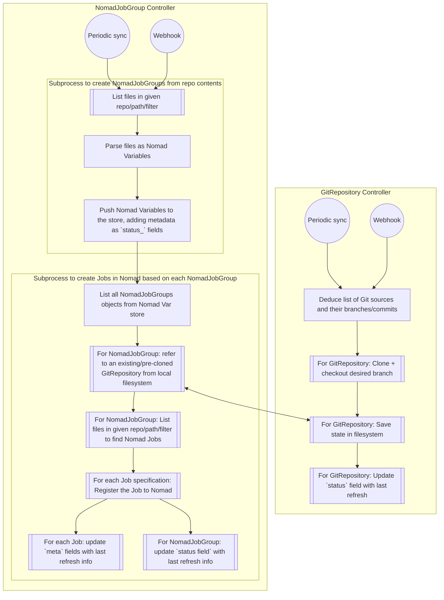

# GitOps for Nomad

This folder contains a quick mockup/POC of what a GitOps controller for Nomad could look like. The structure and overall logic are heavily inspired by [FluxCD](https://fluxcd.io/), especially its `SourceController` and `KustomizeController`. This POC implementation prioritizes fully automatic reconciliation rather than explicitly figuring out diffs/drifts.

I thought this was worth doing, since though there are some implementations for Nomad GitOps already, they generally don't have a lot of following/support, and do not seem to be all that well documented. A tightly scoped set of controllers would likely be a better way to go. [Hashicorp's API for Nomad](https://pkg.go.dev/github.com/hashicorp/nomad/api) is well-documented and relatively straightforward to work with.

## Development commands

```bash
# install go deps
go mod download

# to run the controller's primary loops just once, set the ONE_OFF flag as follows
export NOMAD_GITOPS_ONE_OFF=true

# start the controller
go run ./pkgs

# helpers to work with Nomad
make putvars     # push initial manifests for a GitRepository and NomadJobGroup
make install     # compile the Go binary and make it accessible for local Nomad cluster
make deploy      # run a job to deploy the controller to Nomad
```

## High-level structure and design drafting

[Nomad Variables](https://developer.hashicorp.com/nomad/tutorials/variables/variables-create) allow storing "shared state" similar to how the storage of various objects works in Kubernetes. However, there is a size limit of `64KiB` ([ref](https://developer.hashicorp.com/nomad/api-docs/variables/variables)) on variables, though in my view this should be sufficient. Status information of a specific Job can also be stored with the [`meta`](https://developer.hashicorp.com/nomad/docs/job-specification/meta) block.

The primary "`CRDs`" are defined in [this file](./nomad-gitops-operator/data_structures.go);

- `GitRepository`, struct `GitRepositoryObject`
  - Responsible for storing information about the desired repositories (url, branch) to be fetched
- `NomadJobGroup`, struct `NomadJobGroupObject`
  - References a `GitRepository` by its Nomad Varibale path
  - Responsible for defining the relative path and file name filters to choose `NomadJobGroup` specification files from a referenced repository
  - Responsible for creating new `NomadJobGroup` objects in the cluster after picking them up from the Git GitRepository
  - Responsible for defining the relative path and file name filters to choose Nomad Job specification files from a referenced repository
  - Responsible for applying those Job specifications to the Nomad cluster
  - Named this way as its options can result in the creation of any number of Jobs in Nomad (and it is up to Nomad itself to manage the `Job` objects as usual)

The controllers are structured similarly, the below bullet points describe their functionality:

- [controller_gitrepository.go](./nomad-gitops-operator/controller_gitrepository.go)
  - Fetch list of `GitRepository` objects from Nomad variable store
  - Clone each of these repositories to a configurable path
  - Update the `status_current_commit` field with the latest commit after cloning
- [controller_nomadjobgroup.go](./nomad-gitops-operator/controller_nomadjobgroup.go)
  - Fetch list of `NomadJobGroup` objects from Nomad variable store
  - Fetch list of `GitRepository` objects from Nomad variable store, figure out the right `GitRepository` for each `NomadJobGroup`
  - Controller loop #1: Create/update `NomadJobGroup` objects in relevant paths
    - Find the `NomadJobGroup` files defined in these repositories (using relative path and regex filters for file names)
    - Push them to Nomad as Variables for next reconciliation loop
  - Controller loop #2: Create/update Nomad Jobs
    - Find the job spec files defined in these repositories (using relative path and regex filters for file names)
    - Register (=run) these jobs on Nomad, adding relevant metadata
  - Controller loop #3: (planned) Prune deleted Jobs
    - Based on jobs that exist on the cluster, are managed by the controller (as evidenced by their `meta` block data), but no longer exist in Nomad Variables, should be purged
    - Actual behaviour (whether to delete vs. just log the discrepancy) to be set based on a flag from `NomadJobGroup` (perhaps `purge(bool)`), that is then saved in the `meta` of each job created by that `NomadJobGroup`

Both resource types would also benefit from additional `status` fields to provide more information about the current revision of each app, last update time, reasons for failure, if any, etc. Optimally I would like to see all the information necessary to debug behaviour just by looking at the `status_` fields of these objects - there should be no need to always look at the controller's logs. The state information of a "failed reconciliation" due to for example a malformed Job specification must be stored in one of these controller-managed Nomad Variables.

Finally, adding some type of webhook/API endpoint to trigger immediate reconciliation (or pause reconciliations temporarily) would also improve the operator experience significantly, along with commands for bootstrapping a cluster by initializing it with a `GitRepository` and a `NomadJobGroup`.

## Basic logic flow

*This includes the planned expansion of the `NomadJobGroup` controller to also create new instances of `NomadJobGroup` objects*



## Misc notes

- Need to figure out declarative creation of `GitRepository` objects also
- Clean up the controller code overall, e.g. conversion functions from internal `NomadJobGroupObject` to `api.Variable` for usage with nomad should be accessible from each instance of `NomadJobGroupObject`.
- Partial callables or custom logging structs are worth considering for both controllers, as we end up repeating ourselves a lot at the moment
- Significant room to reduce code repetition by creating some more generic functions for shared use between the different controllers
- Integration tests against a local Nomad cluster should not be too difficult to set up

